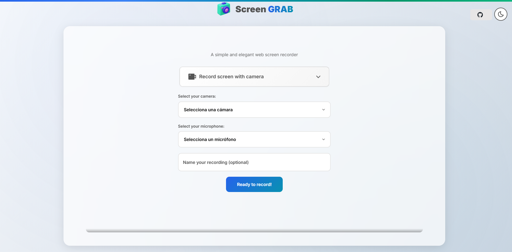
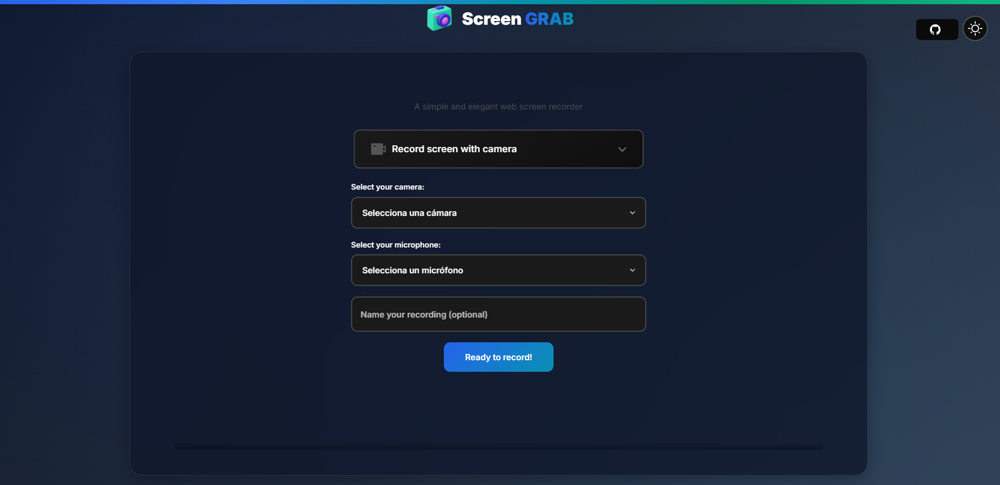

<div align="center">

# 🎬 **ScreenREC**

## 🌟 **Why ScreenREC?**

In a world where **visual content is KING**, you need a tool that DOESN'T limit you. ScreenREC was created to make screen recording easy whenever video calls, tutorials, and demos are ESSENTIAL.

**And the best part? It's completely FREE and without restrictions!**

## 🚀 **Features You'll Love**

_The Most Powerful and Free Screen Recording Tool in the World_


---

## 🚀 **Record Without Limits, No Restrictions, No Costs!**

**🎯 REVOLUTIONIZE your way of creating visual content**

</div>

<div align="center">

### 💎 **What others charge for, we give for FREE**

### ⚡ **What others limit, we make UNLIMITED**

### 💡 **What others complicate, we make SIMPLE**

</div>

---

<div align="center">

## 🔥 **Tired of Limitations? ScreenREC is Your Solution!**

**📹 No time limits** | **💰 No hidden subscriptions** | **🚫 No annoying watermarks**

### 🌐 **[» TRY IT NOW - IT'S FREE! «](https://screenrec.vercel.app)**

_You'll be recording like a pro in less than 10 seconds!_

</div>

---

## 🌟 **Why ScreenREC?**

In a world where **visual content is king**, you need a tool that doesn’t limit you. ScreenREC was created to make screen recording easy whenever you need it for video calls, tutorials, or demos.

**And best of all? It’s completely FREE and without restrictions!**

## 🚀 **Features You'll Love**

<div align="center">

### 🎯 **Elegant and Functional Interface**

</div>

**Light Theme - Perfect for daytime work** ☀️  


**Dark Theme - Ideal for long sessions** 🌙  


<div align="center">

## 💥 **THIS is what will make you ADDICTED to ScreenREC!**

</div>

### 🎬 **UNLIMITED RECORDING**

> **🚀 ZERO time restrictions.** Record from 5 seconds to 5 hours... or more!

### 💰 **100% FREE FOREVER**

> **🎯 No hidden subscriptions, no watermarks, no tricks.** What you see is what you get!

### 🚫 **ZERO ADS**

> **✨ Pure recording experience** without annoying interruptions that ruin your flow.

### 🎵 **CRYSTAL CLEAR AUDIO**

> **🎤 Capture system audio + microphone simultaneously.** Studio quality in your browser.

### 🎨 **ELEGANT THEMES**

> **🌗 Switch between light and dark mode** as you prefer, any time of day.

### 📱 **100% RESPONSIVE**

> **📺 Works perfectly on any screen resolution.** Desktop, laptop, tablet... anywhere!

### ⚡ **NO INSTALLATION**

> **🌐 Directly in your browser.** Just click and start recording!

### 🔒 **TOTAL PRIVACY**

> **🛡️ Everything is processed on YOUR device.** We never send your recordings. YOU are in control.

---

<div align="center">

## 🎯 **TRY IT NOW!**

### 🌐 **[» LIVE DEMO - Click Here! «](https://screenrec.vercel.app)**

_You'll be recording like a pro in less than 10 seconds!_

**⚡ No registration required | 💳 No credit card needed | 📧 No spam**

</div>

---

<div align="center">

## 🏆 **JOIN THE REVOLUTION!**

### 🔥 **Thousands of professionals have already chosen ScreenREC**

### ⭐ **"The best free tool I've ever used" - Verified User**

### 🚀 **"Completely changed my workflow" - Creator Pro**

</div>

---

## 🔥 **Perfect Use Cases - Discover Your Potential!**

<div align="center">

### 🎯 **Which of these situations are you in?**

</div>

### 👨‍💼 **Standout Professionals**

- 📊 **Business presentations** that make an impact
- 🎓 **Tutorials and training** that truly teach
- 🐛 **Bug reports** with irrefutable visual evidence
- 📹 **Product demos** that sell themselves

### 🎮 **Pro Content Creators**

- 🎬 **Gameplay and streaming** with professional quality
- 🖥️ **Step-by-step software tutorials**
- 🎨 **Creative processes** that inspire
- 📚 **Educational content** that transforms lives

### 👨‍🎓 **Innovative Students and Educators**

- 📖 **Dynamic and interactive virtual classes**
- 📝 **Clear and effective homework explanations**
- 🧪 **Documented online experiments**
- 💡 **Collaborative projects** that make a difference

---

<div align="center">

## 🚨 **LAST CHANCE!**

### ⚡ **ScreenREC is 100% FREE... For how much longer?**

</div>

<div align="center">

### 💎 **TOTAL GUARANTEE:**

#### ✅ **No time limits - GUARANTEED**

#### ✅ **No watermarks - GUARANTEED**

#### ✅ **No ads - GUARANTEED**

#### ✅ **Total privacy - GUARANTEED**

---

## 🏃‍♂️ **DON'T WAIT ANY LONGER!**

### **While you read this, others are already creating amazing content**

<div style="background: linear-gradient(90deg, #ff6b6b, #4ecdc4); padding: 20px; border-radius: 10px; margin: 20px 0;">

### 🌐 **[🚀 START RECORDING NOW - IT'S FREE 🚀](https://screenrec.vercel.app)**

**⏰ Only takes 10 seconds | 💯 No registration | 🎬 Instant results**

</div>

---

### 🤔 **Still have doubts?**

**❌ "It doesn't work in my browser"** → ✅ Compatible with Chrome, Firefox, Safari, and Edge  
**❌ "It's too complicated"** → ✅ Literally 3 clicks and you're recording  
**❌ "The quality will be bad"** → ✅ HD recording with crystal clear audio  
**❌ "There must be hidden costs"** → ✅ 100% free, open source, no tricks

</div>

---

## ⚡ **Cutting-Edge Technology**

<div align="center">

### 🏗️ **Built with the Best Modern Web Technologies**

</div>

| Technology               | Purpose          | Why We Chose It                              |
| ------------------------ | ---------------- | -------------------------------------------- |
| 🟧 **Parcel.js**         | Build & Bundling | ⚡ Zero config, blazing fast                 |
| 🟦 **Vanilla JS ES6+**   | Core Logic       | 🚀 Pure performance, no heavy dependencies   |
| 🟪 **Pug Templates**     | Modular HTML     | 📦 Reusable and maintainable components      |
| 🟩 **SCSS/Sass**         | Advanced Styling | 🎨 Variables, mixins, scalable architecture  |
| 🔴 **MediaRecorder API** | Recording        | 🎬 Native browser API, maximum compatibility |

### 🌐 **Web APIs Used**

- **🎥 MediaRecorder API**: High-quality video/audio recording
- **🖥️ getDisplayMedia API**: Native screen capture
- **🎤 getUserMedia API**: Professional microphone access

## 🎮 **Getting Started is Super Easy!**

<div align="center">

### 🚀 **Start Recording in 4 Simple Steps**

</div>

```bash
# 1️⃣ Clone this awesome project
git clone https://github.com/cristopher-dev/screenREC-dev.git
cd screenREC-dev

# 2️⃣ Install dependencies (just once)
npm install

# 3️⃣ Launch the development server!
npm start

# 4️⃣ Open your browser at http://localhost:1234 and start recording! 🎬
```

### 🔥 **Want to deploy your own version?**

```bash
# Build for production (fully optimized)
npm run build

# Your app will be ready in the /dist folder!
```

### 📋 **Browser Compatibility**

| Browser        | Minimum Version | Status     |
| -------------- | --------------- | ---------- |
| 🟢 **Chrome**  | 72+             | ✅ Perfect |
| 🟠 **Firefox** | 65+             | ✅ Perfect |
| 🔵 **Safari**  | 13+             | ✅ Perfect |
| 🟣 **Edge**    | 79+             | ✅ Perfect |

> **💡 Tip:** For the best experience, use Chrome or Firefox.

### 📱 **Supported Devices**

- ✅ **Desktop/Laptop**: Full experience
- ❌ **Mobile/Tablet**: Coming soon (recording APIs not yet available on mobile)

## 📁 Project Structure

```
src/
├── index.pug                 # Main entry point
├── js/
│   ├── index.js             # App initialization
│   ├── components/          # Reusable components
│   │   ├── recorder.js      # Screen recording logic
│   │   └── themeToggler.js  # Theme management
│   └── utils/               # Utility functions
│       ├── constants.js     # App constants
│       ├── errorHandler.js  # Error management
│       └── handleMobileUsers.js # Mobile detection
├── scss/
│   ├── index.scss          # Main stylesheet
│   ├── components/         # Component styles
│   └── utils/              # SCSS utilities
├── partials/               # Pug templates
└── images/                 # Static assets
```

## 🏗️ Architecture

### Singleton Pattern

All main components use the Singleton pattern:

```javascript
// Usage example
import ScreenRecorder from './components/recorder';
const recorder = ScreenRecorder.getInstance();
```

### ES6 Modules

Import/export system for modularity:

```javascript
import ScreenRecorder from './components/recorder';
import ThemeToggler from './components/themeToggler';
```

### State Management

Centralized state within each component:

```javascript
this.state = {
  mime: null,
  mediaRecorder: null,
  isRecording: false,
  isPause: false,
  filename: null,
  selectedOption: null,
  screenStream: null,
  microphoneStream: null,
};
```

## 🎨 Code Conventions

### CSS Classes (BEM-like)

- **Block**: `.sh__component` (sh = ScreenREC)
- **Element**: `.sh__component--element`
- **List**: `.sh__component__list--item`

### JavaScript

- **Constants**: `UPPER_SNAKE_CASE`
- **Variables**: `camelCase`
- **Classes**: `PascalCase`
- **Files**: `camelCase.js`

### Files

- **Pug templates**: `kebab-case.pug`
- **SCSS files**: `kebab-case.scss` with `_` prefix for partials
- **JavaScript**: `camelCase.js`

## 📜 Available Scripts

```bash
# Start development server
npm start

# Build for production
npm run build

# Format code
npm run format

# Check formatting
npm run check-format

# Check linting
npm run check-lint

# Run all checks
npm test
```

## 🔧 Configuration

### ESLint

The project uses ESLint for linting with Prettier integration.

### Prettier

Automatic code formatting with standard configuration.

### Husky

Git hooks for pre-commit checks.

## 🎯 **Quick Usage Guide**

<div align="center">

### 📖 **Record Like a Pro in 5 Steps!**

</div>

### 🎬 **Recording Process:**

1. **🎯 Select your target**

   - 🖥️ Full screen
   - 🪟 Specific window
   - 🌐 Browser tab

2. **🎵 Configure audio (optional)**

   - 🔊 System audio
   - 🎤 Personal microphone
   - 🎭 Or both for maximum quality!

3. **📝 Name your recording (optional)**

   - Give it a custom name
   - Or let us generate one automatically

4. **🎬 RECORD!**

   - ⏺️ Start your recording
   - ⏸️ Pause when needed
   - ⏹️ Stop when finished

5. **📥 Instant download**
   - The file downloads automatically
   - MP4 format compatible everywhere
   - Ready to share!

---

## 🏆 **Why ScreenREC is the BEST Choice**

### 🆚 **REAL Comparison with the Competition:**

| Feature             | ScreenREC           | Other Recorders            |
| ------------------- | ------------------- | -------------------------- |
| **💰 Price**        | ✅ Free Forever     | ❌ Expensive subscriptions |
| **⏱️ Time Limit**   | ✅ Unlimited        | ❌ 5-10 minutes max        |
| **🚫 Ads**          | ✅ Zero ads         | ❌ Annoying ads            |
| **💧 Watermark**    | ✅ No watermark     | ❌ Always shows logo       |
| **📱 Installation** | ✅ Browser only     | ❌ Heavy software          |
| **🔒 Privacy**      | ✅ 100% local       | ❌ Forced cloud upload     |
| **🎨 Interface**    | ✅ Modern and clean | ❌ Outdated                |
| **🌙 Themes**       | ✅ Light and dark   | ❌ Only one option         |

---

<div align="center">

## 🔥 **FINAL CALL!**

### **Don't let the competition limit you**

</div>

<div align="center" style="background: linear-gradient(135deg, #667eea 0%, #764ba2 100%); padding: 30px; border-radius: 15px; color: white; margin: 30px 0;">

## 🚀 **TRANSFORM THE WAY YOU CREATE CONTENT TODAY!**

### **Thousands are already using it... What are you waiting for?**

#### 🌐 **[💎 GET FREE ACCESS NOW 💎](https://screenrec.vercel.app)**

**✨ No tricks | 💯 No limits | 🎬 Professional results**

---

### **⚠️ IMPORTANT NOTE:**

**This project is open source and will always be free.  
Join the community of creators who have already discovered the secret!**

</div>

---

<div align="center">

### 💫 **Did you like ScreenREC?**

**⭐ Give it a star on GitHub!** | **🔄 Share it with your friends** | **💬 Give us your feedback**

**Follow us for more awesome projects:**

[](https://github.com/cristopher-dev)

---

### **📝 Made with ❤️ for the creator community!**

_"The best tool is the one you don't have to pay for and that just works."_

</div>
